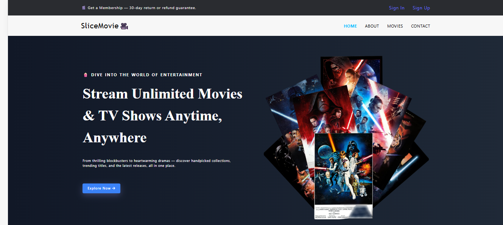

# 🎬 SliceMovie

**SliceMovie** is a sleek and interactive React-based web app that showcases **Avengers movies** by fetching real-time data from the **OMDb API**. Whether you're a Marvel fan or just exploring, this site lets you browse Avengers-related movie details, posters, and more — all within a modern UI.

---

## 🚀 Features

- 🔍 **Real-time Movie Data** from [OMDb API](https://www.omdbapi.com/)
- ⚛️ **Built with React** and **React Router**
- 🧭 **Client-side Routing** for smooth navigation
- ❌ **Custom Error Page** for undefined routes
- 🔐 **Sign In / Sign Up** pages for user interaction
- 🖼️ Attractive UI optimized for both desktop and mobile

---

## 🔧 Tech Stack

- **React**
- **React Router DOM**
- **CSS Modules / Tailwind (optional depending on your setup)**
- **OMDb API**

---

## 📸 Screenshot



---

## 🌐 Live Demo

🔗 [Click here to view the live site](https://slicemovie.netlify.app)

---

## 🛠️ Setup Instructions

1. **Clone the repository**  
   ```bash
   git clone https://github.com/yashsri2802/slicemovie.git
   cd slicemovie
2. **Install dependencies**
   ```bash
   npm install
3. **Add your OMDb API key**
   , create a .env file in the root directory and add:
   ```bash
   VITE_API_KEY=your_api_key_here
4. **Run the development server**
   ```bash
   npm run dev
5. **Visit http://localhost:5173 in your browser.**

## 📬 Feedback or Contributions?
Feel free to open issues or contribute pull requests. Marvel fans and developers are always welcome!

## 📄 License
This project is open-source and available under the MIT License.
